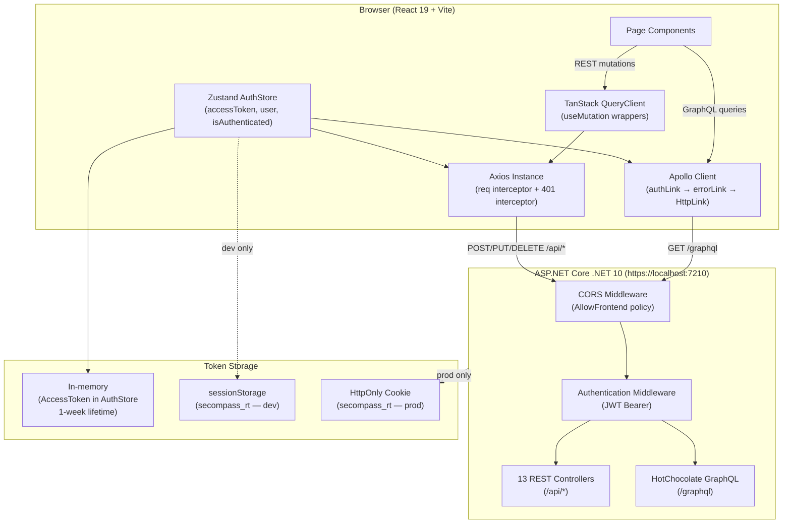
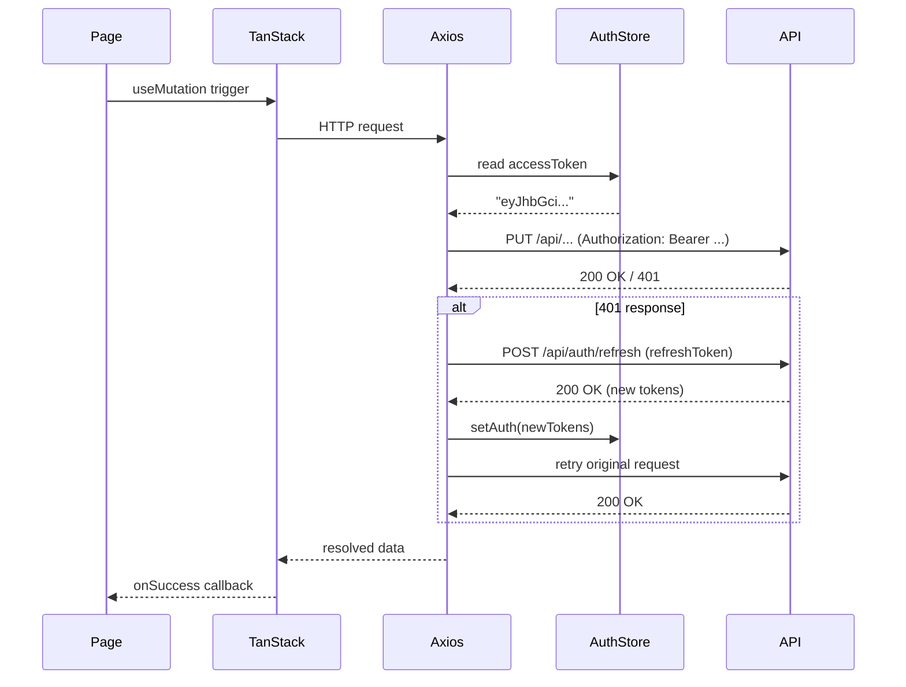
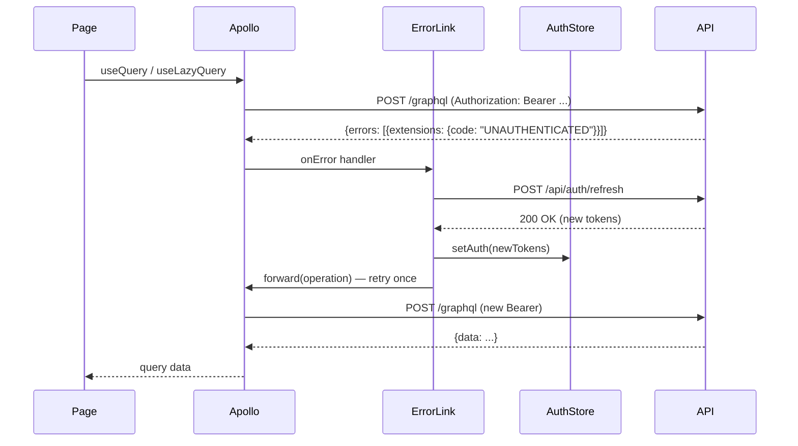

# Design Document — SECompass Integration

## Overview

This document describes the end-to-end integration layer that connects the SECompass React 19 frontend (Vite + TypeScript, `frontend/`) to the ASP.NET Core .NET 10 backend (3-layer architecture, `backend/`). The integration is split into two sides:

**Backend changes** — minimal surgical additions to an already-working API:
- CORS policy (`AllowFrontend`) with dev/prod environment branching
- Startup validation that throws on missing required configuration keys
- JWT access tokens issued with a 1-week expiration

**Frontend changes** — transforming static shell pages into a fully data-driven application:
- New npm dependencies (axios, TanStack Query, Apollo Client, Zustand, React Flow, etc.)
- Environment variable management with a Vite build-time warning plugin
- Vite dev proxy eliminating CORS complexity in development
- Zustand `AuthStore` for in-memory JWT state
- Axios instance with Bearer injection and 401-refresh interceptor
- Apollo Client with `authLink` / `errorLink` and `HttpLink` to `/graphql`
- `ProtectedRoute` and `AdminRoute` wrappers in `routes.tsx`
- Per-page GraphQL `useQuery`/`useLazyQuery` and REST `useMutation` wiring
- React Flow canvas replacing the custom SVG implementation in `RoadmapCanvas.tsx`
- `NODE_STATUS_COLORS` constant shared across canvas nodes, `StatusChip`, and drawers

All GraphQL reads go through Apollo Client; all write operations go through TanStack Query + Axios.


---

## Architecture

### High-Level Data Flow



### Request Lifecycle (Authenticated REST Mutation)



### Token Refresh Retry (Apollo GraphQL)




---

## Components and Interfaces

### 1. Backend: CORS Policy (`ServiceCollectionExtensions.cs`)

Add `AddCors` with an `AllowFrontend` policy. The policy branches on `IWebHostEnvironment.IsDevelopment()`:

```csharp
// In AddApplicationServices, BEFORE services.AddAuthentication(...)
var allowedOrigins = env.IsDevelopment()
    ? new[] { "https://localhost:5173" }
    : (configuration["Cors:AllowedOrigins"] ?? "")
        .Split(',', StringSplitOptions.RemoveEmptyEntries | StringSplitOptions.TrimEntries);

services.AddCors(options =>
{
    options.AddPolicy("AllowFrontend", policy =>
    {
        if (allowedOrigins.Length > 0)
            policy.WithOrigins(allowedOrigins);
        // else: no origins — all cross-origin requests will be rejected

        policy
            .WithMethods("GET", "POST", "PUT", "DELETE", "OPTIONS")
            .WithHeaders("Authorization", "Content-Type", "X-Requested-With")
            .AllowCredentials();
    });
});
```

Add `UseCors` in `Program.cs` **after** `UseRouting` but **before** `UseAuthentication`:

```csharp
app.UseRouting();
app.UseCors("AllowFrontend");   // ← inserted here
app.UseAuthentication();
app.UseAuthorization();
```

### 2. Backend: Startup Validation (`Program.cs`)

Throw before `builder.Build()` if required keys are absent:

```csharp
// After builder.Services.AddApplicationServices(...)
static void ValidateRequiredConfig(IConfiguration cfg)
{
    var required = new[]
    {
        "Jwt:Secret", "Jwt:Issuer", "Jwt:Audience",
        "ConnectionStrings:DefaultConnection"
    };
    var missing = required.Where(k => string.IsNullOrWhiteSpace(cfg[k])).ToList();
    if (missing.Count > 0)
        throw new InvalidOperationException(
            $"Missing required configuration keys: {string.Join(", ", missing)}");
}
ValidateRequiredConfig(builder.Configuration);
```

### Backend Auth: Access Token Lifetime

Ensure every access token produced by `/api/auth/login`, `/api/auth/register`, `/api/auth/google`, and `/api/auth/refresh` uses a 1-week expiration:

```csharp
var expiresAt = DateTime.Now.AddDays(7);
// Use expiresAt as the JWT Expires value for every issued access token.
```


### 3. Frontend: File/Directory Structure

```
frontend/
├── .env                        # placeholder keys only (committed)
├── .env.local                  # real values (gitignored)
├── vite.config.ts              # proxy + envWarningPlugin
├── src/
│   ├── main.tsx                # wrap with providers
│   ├── app/
│   │   ├── App.tsx
│   │   ├── routes.tsx          # ProtectedRoute + AdminRoute wrappers
│   │   ├── components/
│   │   │   ├── ProtectedRoute.tsx   # NEW
│   │   │   ├── AdminRoute.tsx       # NEW
│   │   │   └── ... (existing)
│   │   └── pages/
│   │       └── ... (existing, all wired)
│   ├── constants/
│   │   └── nodeStatus.ts            # NEW — NODE_STATUS_COLORS
│   ├── graphql/
│   │   └── queries.ts               # NEW — all named GQL operations
│   ├── lib/
│   │   ├── apollo.ts                # NEW — ApolloClient instance
│   │   ├── axios.ts                 # NEW — Axios instance
│   │   └── queryClient.ts           # NEW — TanStack QueryClient
│   └── store/
│       └── authStore.ts             # NEW — Zustand AuthStore
```

### 4. Frontend: Zustand AuthStore (`src/store/authStore.ts`)

```typescript
import { create } from 'zustand';

export interface AuthUser {
  id: string;        // UUID
  email: string;
  role: 'Student' | 'Mentor' | 'Admin';
  profileId: string; // UUID
}

interface AuthState {
  accessToken: string | null;
  user: AuthUser | null;
  isAuthenticated: boolean;
  _initialized: boolean;
}

interface AuthActions {
  setAuth: (accessToken: string, user: AuthUser, refreshToken?: string) => void;
  clearAuth: () => void;
  initFromStorage: () => void;
}

export type AuthStore = AuthState & AuthActions;

const REFRESH_TOKEN_KEY = 'secompass_rt';

export const useAuthStore = create<AuthStore>((set) => ({
  accessToken: null,
  user: null,
  isAuthenticated: false,
  _initialized: false,

  setAuth: (accessToken, user, refreshToken) => {
    if (refreshToken && import.meta.env.DEV) {
      sessionStorage.setItem(REFRESH_TOKEN_KEY, refreshToken);
    }
    set({ accessToken, user, isAuthenticated: true });
  },

  clearAuth: () => {
    sessionStorage.removeItem(REFRESH_TOKEN_KEY);
    set({ accessToken: null, user: null, isAuthenticated: false });
  },

  initFromStorage: () => {
    // In dev: check sessionStorage for a refresh token to determine if session
    // may still be valid. Access token is never stored — we mark _initialized
    // to end the loading state. A silent refresh will be attempted by the
    // interceptor on the next API call if accessToken is null.
    set({ _initialized: true });
  },
}));

export const getRefreshToken = (): string | null =>
  sessionStorage.getItem(REFRESH_TOKEN_KEY);
```


### 5. Frontend: Axios Instance (`src/lib/axios.ts`)

```typescript
import axios from 'axios';
import { useAuthStore, getRefreshToken } from '@/store/authStore';

export const apiClient = axios.create({
  baseURL: import.meta.env.VITE_API_URL ?? '',
  headers: { 'Content-Type': 'application/json' },
});

// Request interceptor — inject Bearer token
apiClient.interceptors.request.use((config) => {
  const token = useAuthStore.getState().accessToken;
  if (token) {
    config.headers.Authorization = `Bearer ${token}`;
  }
  return config;
});

// Shared refresh state to prevent concurrent refresh calls
let refreshPromise: Promise<string> | null = null;

// Response interceptor — 401 → refresh → retry once
apiClient.interceptors.response.use(
  (response) => response,
  async (error) => {
    const original = error.config;
    if (error.response?.status === 401 && !original._retried) {
      original._retried = true;
      try {
        if (!refreshPromise) {
          const rt = getRefreshToken();
          refreshPromise = apiClient
            .post<{ accessToken: string; refreshToken: string; user: AuthUser }>(
              '/api/auth/refresh',
              { refreshToken: rt },
            )
            .then((res) => {
              const { accessToken, refreshToken, user } = res.data;
              useAuthStore.getState().setAuth(accessToken, user, refreshToken);
              return accessToken;
            })
            .finally(() => { refreshPromise = null; });
        }
        const newToken = await refreshPromise;
        original.headers.Authorization = `Bearer ${newToken}`;
        return apiClient(original);
      } catch {
        useAuthStore.getState().clearAuth();
        window.location.href = '/login';
        return Promise.reject(error);
      }
    }
    return Promise.reject(error);
  },
);
```

### 6. Frontend: Apollo Client (`src/lib/apollo.ts`)

```typescript
import {
  ApolloClient, InMemoryCache, HttpLink,
  from, Observable,
} from '@apollo/client';
import { setContext } from '@apollo/client/link/context';
import { onError } from '@apollo/client/link/error';
import { useAuthStore, getRefreshToken } from '@/store/authStore';
import { apiClient } from './axios';

const httpLink = new HttpLink({
  uri: `${import.meta.env.VITE_API_URL ?? ''}/graphql`,
});

const authLink = setContext((_, { headers }) => {
  const token = useAuthStore.getState().accessToken;
  return {
    headers: {
      ...headers,
      ...(token ? { Authorization: `Bearer ${token}` } : {}),
    },
  };
});

const errorLink = onError(({ graphQLErrors, operation, forward }) => {
  const isUnauthenticated = graphQLErrors?.some(
    (e) => e.extensions?.code === 'UNAUTHENTICATED',
  );
  if (!isUnauthenticated) return;

  return new Observable((observer) => {
    apiClient
      .post('/api/auth/refresh', { refreshToken: getRefreshToken() })
      .then(({ data }) => {
        useAuthStore.getState().setAuth(data.accessToken, data.user, data.refreshToken);
        const subscriber = {
          next: observer.next.bind(observer),
          error: observer.error.bind(observer),
          complete: observer.complete.bind(observer),
        };
        forward(operation).subscribe(subscriber);
      })
      .catch(() => {
        useAuthStore.getState().clearAuth();
        window.location.href = '/login';
        observer.error(new Error('Session expired'));
      });
  });
});

export const apolloClient = new ApolloClient({
  link: from([errorLink, authLink, httpLink]),
  cache: new InMemoryCache(),
});
```


### 7. Frontend: Provider Tree (`src/main.tsx`)

```typescript
import { createRoot } from 'react-dom/client';
import { ApolloProvider } from '@apollo/client';
import { QueryClientProvider } from '@tanstack/react-query';
import { GoogleOAuthProvider } from '@react-oauth/google';
import App from './app/App.tsx';
import { apolloClient } from './lib/apollo';
import { queryClient } from './lib/queryClient';
import './styles/index.css';

createRoot(document.getElementById('root')!).render(
  <GoogleOAuthProvider clientId={import.meta.env.VITE_GOOGLE_CLIENT_ID ?? ''}>
    <ApolloProvider client={apolloClient}>
      <QueryClientProvider client={queryClient}>
        <App />
      </QueryClientProvider>
    </ApolloProvider>
  </GoogleOAuthProvider>
);
```

### 8. Frontend: TanStack QueryClient (`src/lib/queryClient.ts`)

```typescript
import { QueryClient } from '@tanstack/react-query';

export const queryClient = new QueryClient({
  defaultOptions: {
    queries: { retry: 1, staleTime: 30_000 },
    mutations: { retry: 0 },
  },
});
```

### 9. Frontend: ProtectedRoute (`src/app/components/ProtectedRoute.tsx`)

```typescript
import { Navigate, Outlet, useLocation } from 'react-router';
import { useAuthStore } from '@/store/authStore';
import { Skeleton } from './Skeleton';

export function ProtectedRoute() {
  const { isAuthenticated, _initialized } = useAuthStore();
  const location = useLocation();

  if (!_initialized) return <Skeleton />;
  if (!isAuthenticated) {
    return <Navigate to="/login" state={{ from: location.pathname }} replace />;
  }
  return <Outlet />;
}
```

### 10. Frontend: AdminRoute (`src/app/components/AdminRoute.tsx`)

```typescript
import { Navigate, Outlet, useLocation } from 'react-router';
import { useAuthStore } from '@/store/authStore';
import { Skeleton } from './Skeleton';

export function AdminRoute() {
  const { isAuthenticated, user, _initialized } = useAuthStore();
  const location = useLocation();

  if (!_initialized) return <Skeleton />;
  if (!isAuthenticated) {
    return <Navigate to="/login" state={{ from: location.pathname }} replace />;
  }
  if (user?.role !== 'Admin') {
    return <Navigate to="/dashboard" replace />;
  }
  return <Outlet />;
}
```

### 11. Frontend: routes.tsx Update

```typescript
// Wrap protected routes with <ProtectedRoute> and admin routes with <AdminRoute>
{
  element: <ProtectedRoute />,
  children: [
    { path: '/dashboard', Component: DashboardPage },
    { path: '/roadmaps', Component: RoadmapsPage },
    { path: '/roadmap/:id', Component: RoadmapCanvasPage },
    { path: '/mentor', Component: MentorPage },
    { path: '/skill-gap', Component: SkillGapPage },
    { path: '/market', Component: MarketPulsePage },
    { path: '/portfolio', Component: PortfolioPage },
    { path: '/settings', Component: SettingsPage },
  ],
},
{
  element: <AdminRoute />,
  children: [
    { path: '/admin/career-roles', Component: AdminCareerRolesPage },
    { path: '/admin/roadmaps', Component: AdminRoadmapTemplatesPage },
    { path: '/admin/nodes', Component: AdminNodeLibraryPage },
    { path: '/admin/job-trends', Component: AdminJobTrendsPage },
  ],
},
// Public routes remain at root level (/, /login, /register, /portfolio/:username)
```


### 12. Frontend: NODE_STATUS_COLORS (`src/constants/nodeStatus.ts`)

```typescript
export type NodeStatusInt = 0 | 1 | 2 | 3 | 4;

export interface NodeStatusStyle {
  fill: string;
  stroke: string;
  text: string;
  label: string;
}

export const NODE_STATUS_COLORS: Record<NodeStatusInt, NodeStatusStyle> = {
  0: { // NotStarted
    fill:   'var(--md3-status-not-started-fill)',
    stroke: 'var(--md3-status-not-started-stroke)',
    text:   'var(--md3-status-not-started-text)',
    label:  'Not Started',
  },
  1: { // InProgress
    fill:   'var(--md3-status-in-progress-fill)',
    stroke: 'var(--md3-status-in-progress-stroke)',
    text:   'var(--md3-status-in-progress-text)',
    label:  'In Progress',
  },
  2: { // Paused
    fill:   'var(--md3-status-paused-fill)',
    stroke: 'var(--md3-status-paused-stroke)',
    text:   'var(--md3-status-paused-text)',
    label:  'Paused',
  },
  3: { // Skipped
    fill:   'var(--md3-status-skipped-fill)',
    stroke: 'var(--md3-status-skipped-stroke)',
    text:   'var(--md3-status-skipped-text)',
    label:  'Skipped',
  },
  4: { // Completed
    fill:   'var(--md3-status-completed-fill)',
    stroke: 'var(--md3-status-completed-stroke)',
    text:   'var(--md3-status-completed-text)',
    label:  'Completed',
  },
};
```

### 13. Frontend: React Flow Canvas (`RoadmapCanvas.tsx`)

Replace the current SVG + absolute-positioned `<button>` approach with `@xyflow/react`:

```typescript
import ReactFlow, {
  Background, Controls, MiniMap,
  type Node, type Edge,
} from '@xyflow/react';
import '@xyflow/react/dist/style.css';
import { NODE_STATUS_COLORS, type NodeStatusInt } from '@/constants/nodeStatus';

// Mapping from GetPersonalRoadmapWithProgress response:
function mapToFlowNodes(progressNodes: NodeProgressWithDetail[]): Node[] {
  return progressNodes.map((np) => ({
    id: np.nodeProgressId,
    type: 'roadmapNode',          // custom node type
    position: { x: np.node.positionX, y: np.node.positionY },
    data: {
      label: np.node.title,
      status: np.status as NodeStatusInt,
      nodeId: np.nodeId,
      nodeProgressId: np.nodeProgressId,
    },
  }));
}

function mapToFlowEdges(progressNodes: NodeProgressWithDetail[]): Edge[] {
  return progressNodes.flatMap((np) =>
    (np.node.childIds ?? []).map((childId) => ({
      id: `${np.nodeId}-${childId}`,
      source: np.nodeProgressId,
      target: progressNodes.find((p) => p.nodeId === childId)?.nodeProgressId ?? childId,
      animated: np.status === 1 /* InProgress */,
    }))
  );
}
```

The custom `roadmapNode` node type reads `data.status` to apply `NODE_STATUS_COLORS` for `background`, `border`, and `color`.


### 14. Frontend: Vite Config Update (`vite.config.ts`)

```typescript
import { defineConfig, type Plugin } from 'vite';
import react from '@vitejs/plugin-react';
import tailwindcss from '@tailwindcss/vite';
import path from 'path';

// Build-time warning plugin for missing env vars
function envWarningPlugin(requiredVars: string[]): Plugin {
  return {
    name: 'env-warning',
    buildStart() {
      for (const varName of requiredVars) {
        if (!process.env[varName]) {
          console.warn(`[env-warning] Missing env variable: ${varName}`);
        }
      }
    },
  };
}

export default defineConfig({
  plugins: [
    react(),
    tailwindcss(),
    envWarningPlugin(['VITE_API_URL', 'VITE_GOOGLE_CLIENT_ID']),
  ],
  resolve: {
    alias: { '@': path.resolve(__dirname, './src') },
  },
  server: {
    proxy: {
      '/api': {
        target: 'https://localhost:7210',
        changeOrigin: true,
        secure: false,
      },
      '/graphql': {
        target: 'https://localhost:7210',
        changeOrigin: true,
        secure: false,
      },
    },
  },
});
```

### 15. Frontend: Environment Files

**`.env`** (committed, placeholders only):
```
VITE_API_URL=
VITE_GOOGLE_CLIENT_ID=
```

**`.env.local`** (gitignored, real dev values):
```
VITE_API_URL=
VITE_GOOGLE_CLIENT_ID=1066573154515-pgiqct5pra74rj7bc2583kbo3lgvfgot.apps.googleusercontent.com
```

> `VITE_API_URL` is intentionally empty in dev because the Vite proxy handles `/api` and `/graphql` routes — the browser never hits the backend directly.

**`.gitignore` additions:**
```
.env.local
.env.production.local
.env.*.local
appsettings.Production.json
```

### 16. Frontend: GraphQL Document Definitions (`src/graphql/queries.ts`)

All named operations exported as `DocumentNode` constants (using `gql` tag from `@apollo/client`):

| Constant Name | Operation | Variables |
|---|---|---|
| `GET_USER_BY_ID` | `GetUserById` | `$userId: UUID!` |
| `GET_PROFILE_WITH_SKILLS` | `GetProfileWithSkills` | `$userId: UUID!` |
| `GET_CAREER_ROLES` | `GetCareerRoles` | — |
| `GET_CAREER_ROADMAPS_BY_ROLE` | `GetCareerRoadmapsByRole` | `$careerRoleId: UUID!` |
| `GET_CAREER_ROADMAP_WITH_NODES` | `GetCareerRoadmapWithNodes` | `$roadmapId: UUID!` |
| `GET_NODE_HIERARCHY` | `GetNodeHierarchy` | `$rootId: UUID!` |
| `GET_NODE_CHILDREN` | `GetNodeChildren` | `$parentId: UUID!` |
| `GET_PERSONAL_ROADMAPS_BY_PROFILE` | `GetPersonalRoadmapsByProfile` | `$profileId: UUID!` |
| `GET_PERSONAL_ROADMAP_WITH_PROGRESS` | `GetPersonalRoadmapWithProgress` | `$personalRoadmapId: UUID!` |
| `GET_NODE_PROGRESS` | `GetNodeProgress` | `$personalRoadmapId: UUID!` |
| `GET_LEARNING_RESOURCES_BY_NODE` | `GetLearningResourcesByNode` | `$nodeId: UUID!` |
| `GET_RECOMMENDED_RESOURCES` | `GetRecommendedResources` | `$profileId: UUID!, $nodeId: UUID!` |
| `GET_GITHUB_REPOS_BY_PROFILE` | `GetGitHubRepositoriesByProfile` | `$profileId: UUID!` |
| `GET_PORTFOLIO_ANALYSIS` | `GetPortfolioAnalysis` | `$profileId: UUID!` |
| `GET_CHAT_SESSIONS_BY_PROFILE` | `GetChatSessionsByProfile` | `$profileId: UUID!` |
| `GET_CHAT_SESSION_WITH_MESSAGES` | `GetChatSessionWithMessages` | `$sessionId: UUID!` |
| `GET_JOB_TRENDS_BY_REGION` | `GetJobTrendsByRegion` | `$region: String!` |
| `GET_TOP_TRENDING_SKILLS` | `GetTopTrendingSkills` | `$count: Int!` |
| `GET_SKILL_GAP_ANALYSIS` | `GetSkillGapAnalysis` | `$profileId: UUID!, $careerRoadmapId: UUID!` |
| `GET_TRENDING_SKILL_RECOMMENDATIONS` | `GetTrendingSkillRecommendations` | `$profileId: UUID!` |
| `GET_PROFILE_BY_USER_ID` | `GetProfileByUserId` | `$userId: UUID!` |


---

## Data Models

### TypeScript Interfaces — Key API DTOs

```typescript
// src/types/api.ts

export interface AuthResponseDto {
  accessToken: string;
  refreshToken: string;
  user: {
    id: string;
    email: string;
    role: 'Student' | 'Mentor' | 'Admin';
    profileId: string;
  };
}

export interface LoginUserDto {
  email: string;
  password: string;
}

export interface RegisterUserDto {
  email: string;
  password: string;
  fullName: string;
}

export interface GoogleLoginDto {
  idToken: string;
}

export interface RefreshTokenRequestDto {
  refreshToken: string;
}

export interface UpdateNodeProgressStatusDto {
  status: 0 | 1 | 2 | 3 | 4;  // NodeStatus enum
  note?: string;
}

export interface NodeProgressDto {
  nodeProgressId: string;
  nodeId: string;
  status: 0 | 1 | 2 | 3 | 4;
  note?: string;
  node: NodeDto;
}

export interface NodeDto {
  id: string;
  title: string;
  description?: string;
  positionX: number;
  positionY: number;
  childIds?: string[];
}

export interface PersonalRoadmapDetailDto {
  id: string;
  title: string;
  profileId: string;
  careerRoadmapId: string;
  nodeProgress: NodeProgressDto[];
}

export interface GeneratePersonalRoadmapRequestDto {
  profileId: string;
  careerRoadmapId: string;
}

export interface UpdateProfileDto {
  fullName?: string;
  bio?: string;
  location?: string;
  avatarUrl?: string;
}

export interface CreateSkillDto {
  profileId: string;
  skillName: string;
  proficiencyLevel: number; // 1–5
}

export interface CreateGitHubRepositoryDto {
  profileId: string;
  repositoryUrl: string;
  description?: string;
}

export interface CreateChatSessionDto {
  profileId: string;
  title: string;
}

export interface SendMessageDto {
  content: string;
  role: 'User';
}
```

### React Flow Node Data Shape

```typescript
// Used as the `data` prop of each XYFlow Node
export interface RoadmapNodeData {
  label: string;
  status: NodeStatusInt;       // 0–4, maps to NODE_STATUS_COLORS
  nodeId: string;              // backend NodeDto.id
  nodeProgressId: string;      // backend NodeProgressDto.nodeProgressId
}
```

### AuthStore State Shape

```typescript
// Full state slice as consumed by components
export interface AuthState {
  accessToken: string | null;
  user: AuthUser | null;           // null when unauthenticated
  isAuthenticated: boolean;
  _initialized: boolean;           // true after initFromStorage() completes
}
```


---

## Per-Page Data Wiring Plan

| Page | GraphQL queries (`useQuery` / `useLazyQuery`) | REST mutations (`useMutation`) | Apollo cache invalidation |
|---|---|---|---|
| **Login** | — | `POST /api/auth/login` → `AuthResponseDto` | — |
| **Register** | — | `POST /api/auth/register` → `AuthResponseDto` | — |
| **Dashboard** | `GetUserById($userId)`, `GetPersonalRoadmapsByProfile($profileId)` | — | — |
| **Roadmaps** | `GetPersonalRoadmapsByProfile($profileId)`, `GetCareerRoles`, `GetCareerRoadmapsByRole($careerRoleId)` [lazy] | `POST /api/personal-roadmaps/generate`, `DELETE /api/personal-roadmaps/{id}` | `GetPersonalRoadmapsByProfile` |
| **RoadmapCanvas** | `GetPersonalRoadmapWithProgress($id)`, `GetNodeProgress($id)`, `GetLearningResourcesByNode($nodeId)` [lazy], `GetRecommendedResources($profileId,$nodeId)` [lazy] | `PUT /api/node-progress/{nodeProgressId}/status` | `GetNodeProgress` |
| **Mentor** | `GetChatSessionsByProfile($profileId)`, `GetChatSessionWithMessages($sessionId)` [lazy] | `POST /api/chat/sessions`, `POST /api/chat/sessions/{id}/messages` | `GetChatSessionWithMessages` (direct cache write) |
| **SkillGap** | `GetSkillGapAnalysis($profileId,$careerRoadmapId)`, `GetTrendingSkillRecommendations($profileId)`, `GetSkillGapAnalysis` [lazy on role change] | — | — |
| **MarketPulse** | `GetJobTrendsByRegion("Vietnam")`, `GetTopTrendingSkills(10)`, `GetJobTrendsByRegion($region)` [lazy on region change] | — | — |
| **Portfolio** | `GetGitHubRepositoriesByProfile($profileId)`, `GetPortfolioAnalysis($profileId)` | `POST /api/github-repositories`, `DELETE /api/github-repositories/{id}` | `GetGitHubRepositoriesByProfile` |
| **PublicPortfolio** | `GetProfileByUserId($userId)`, `GetGitHubRepositoriesByProfile($profileId)` (no auth header) | — | — |
| **Settings** | `GetProfileWithSkills($userId)` | `PUT /api/profiles/{userId}`, `POST /api/skills`, `DELETE /api/skills/{id}` | `GetProfileWithSkills` |
| **AdminCareerRoles** | `GetCareerRoles` | `POST /api/career-roles`, `PUT /api/career-roles/{id}`, `DELETE /api/career-roles/{id}` | `GetCareerRoles` |
| **AdminRoadmapTemplates** | `GetCareerRoadmapsByRole($careerRoleId)`, `GetCareerRoadmapWithNodes($roadmapId)` [lazy] | `POST /api/career-roadmaps`, `PUT /api/career-roadmaps/{id}`, `DELETE /api/career-roadmaps/{id}`, `POST /api/career-roadmaps/{id}/nodes/{nodeId}`, `DELETE /api/career-roadmaps/{id}/nodes/{nodeId}` | `GetCareerRoadmapsByRole` |
| **AdminNodeLibrary** | `GetNodeHierarchy($rootId)` [lazy], `GetNodeChildren($parentId)` [lazy] | `POST /api/nodes`, `PUT /api/nodes/{id}`, `DELETE /api/nodes/{id}` | `GetNodeChildren` |
| **AdminJobTrends** | `GetJobTrendsByRegion($region)` | `POST /api/job-trends`, `PUT /api/job-trends/{id}`, `DELETE /api/job-trends/{id}` | `GetJobTrendsByRegion` |


---

## Correctness Properties

*A property is a characteristic or behavior that should hold true across all valid executions of a system — essentially, a formal statement about what the system should do. Properties serve as the bridge between human-readable specifications and machine-verifiable correctness guarantees.*

**Property Reflection:** After prework analysis, the following properties were identified. Properties 1 and 2 (AuthStore atomicity and state consistency) were merged into one comprehensive property because if a single `setAuth` call updates all three fields correctly for any input, atomicity is already implied. Properties 5 and 6 (ProtectedRoute and AdminRoute redirect for unauthenticated users) share the same redirect-to-login logic but have distinct destination behavior for authenticated users, so they are kept separate but their "unauthenticated → /login" branches are noted as overlapping.

---

### Property 1: AuthStore `setAuth` produces complete, consistent state

*For any* valid `AuthResponseDto` (any access token string, any user object with id/email/role/profileId, any refresh token string), a single call to `setAuth(accessToken, user, refreshToken)` SHALL result in AuthStore state where `isAuthenticated === true`, `accessToken` equals the provided token, `user` equals the provided user object, and no token value is written to `localStorage`.

**Validates: Requirements 4.1, 4.3**

---

### Property 2: Axios Bearer injection respects token presence

*For any* HTTP request dispatched through the Axios instance, if the AuthStore `accessToken` is a non-null, non-empty string at the time the request is sent, the outgoing request SHALL contain an `Authorization` header with value `Bearer {accessToken}`. Conversely, if `accessToken` is null, the `Authorization` header SHALL be absent from the outgoing request.

**Validates: Requirements 4.4**

---

### Property 3: Axios 401 interceptor retries exactly once on refresh success

*For any* HTTP request that receives a 401 response, if `POST /api/auth/refresh` returns a 200 with a new access token, the interceptor SHALL retry the original request exactly once with the new `Authorization: Bearer {newAccessToken}` header, and SHALL NOT retry it again even if the retry also receives a 401.

**Validates: Requirements 4.5**

---

### Property 4: Apollo `authLink` Bearer injection mirrors Axios behavior

*For any* GraphQL operation sent through Apollo Client, if the AuthStore `accessToken` is non-null at operation time, the HTTP request SHALL contain `Authorization: Bearer {accessToken}`. If `accessToken` is null, the header SHALL be absent, enabling unauthenticated public queries (e.g., PublicPortfolio).

**Validates: Requirements 4.7, 20.4**

---

### Property 5: CORS `AllowFrontend` policy allows exactly the configured origins

*For any* non-empty list of origin strings supplied in the `Cors:AllowedOrigins` configuration key under the Production environment, the built `AllowFrontend` CORS policy SHALL allow requests from exactly those origins and SHALL reject requests from origins not in the list.

**Validates: Requirements 1.3, 1.8**

---

### Property 6: ProtectedRoute redirects any unauthenticated user with `state.from`

*For any* protected route path and any unauthenticated AuthStore state (after `_initialized = true`), the `ProtectedRoute` component SHALL redirect to `/login` with `state.from` set to the original pathname, regardless of which specific protected route was requested.

**Validates: Requirements 5.1, 5.4**

---

### Property 7: AdminRoute redirects non-Admin authenticated users to `/dashboard`

*For any* admin route path and any authenticated user whose `role` is not `'Admin'`, the `AdminRoute` component SHALL redirect to `/dashboard`. For the same admin route with an unauthenticated user, it SHALL redirect to `/login` with `state.from` preserving the original path.

**Validates: Requirements 5.2, 5.3, 5.5**

---

### Property 8: Optimistic node status update is immediate and independent of mutation resolution

*For any* roadmap node with initial status S and any new target status S' (where S' is one of 0–4), selecting S' in the node drawer SHALL immediately update the node's displayed status to S' in local React state before the `PUT /api/node-progress/{id}/status` mutation resolves or rejects.

**Validates: Requirements 9.2**

---

### Property 9: Failed node status mutation reverts to the original status

*For any* roadmap node with initial status S, after an optimistic update to status S', if the `PUT /api/node-progress/{id}/status` mutation returns a 4xx or 5xx response, the node's displayed status SHALL revert to S (the value it held before the optimistic update was applied).

**Validates: Requirements 9.3**


---

## Error Handling

### Backend

| Scenario | Behavior |
|---|---|
| Missing required config key at startup | `InvalidOperationException` thrown before `builder.Build()` — process exits, startup fails loudly |
| Missing `Cors:AllowedOrigins` in Production | CORS policy built with zero allowed origins — cross-origin requests blocked by browser |
| JWT validation failure | 401 response from `[Authorize]` middleware; no custom handling needed |
| Service layer returns `Success = false` | Controller returns `BadRequest` / `NotFound` with `result.Error` message |
| Unhandled exception | `ExceptionHandlingMiddleware` catches, logs via Serilog, returns 500 with RFC 7807 `ProblemDetails` |

### Frontend — Error Boundaries

| Layer | Error | Handling |
|---|---|---|
| Axios interceptor | 401 on any REST call | Attempt token refresh; if refresh fails → `clearAuth()` + navigate `/login` |
| Axios interceptor | Non-401 error | Reject with the error; let `useMutation` `onError` surface it to the Snackbar |
| Apollo `errorLink` | `UNAUTHENTICATED` GraphQL error | Attempt token refresh + retry once; if refresh fails → `clearAuth()` + navigate `/login` |
| Apollo `errorLink` | Other GraphQL errors | Propagate to `useQuery` `error` state → page renders `EmptyState` with retry |
| `useMutation` `onError` | Any mutation error | Extract `error.response?.data` message → display in existing `Snackbar` component |
| `useQuery` `error` | Any query error | Render `EmptyState` component with descriptive message and retry callback |
| React Flow | Node map failure (bad data) | Show `EmptyState` in canvas area; log to console |
| `ProtectedRoute` / `AdminRoute` | Not yet initialized | Render `Skeleton` component until `_initialized = true` |

### Error Message Extraction Pattern

```typescript
// Shared utility: src/lib/getErrorMessage.ts
export function getErrorMessage(error: unknown): string {
  if (axios.isAxiosError(error)) {
    return error.response?.data?.message
      ?? error.response?.data          // string response
      ?? error.message
      ?? 'An unexpected error occurred';
  }
  if (error instanceof Error) return error.message;
  return 'An unexpected error occurred';
}
```


---


